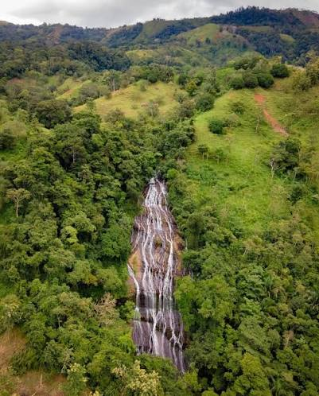

# Vinculacion del patrimonio cultural del Territorio Huertar de Zapaton en el Plan de Manejo del Parque Nacional La Cangreja

Zapaton y el Parque Nacional La Cangreja se encuentra en el canton de **Puriscal**

## Extension del Parque Nacional La Cangreja

La Cangreja tiene una extension de _2.519 a 2.570 hectáreas_

### Pagina del Plan de Manejo actual

[Sitio web del SINAC](https://sinac.go.cr/ES/ac/accvc/pnlc/Paginas/default.aspx)

### Pueblo Huetar

*En esta seccion daremos un poco de contexto acerca de la poblacion indigena Huetar*

[Wikipedia](https://es.wikipedia.org/wiki/Huetares)

