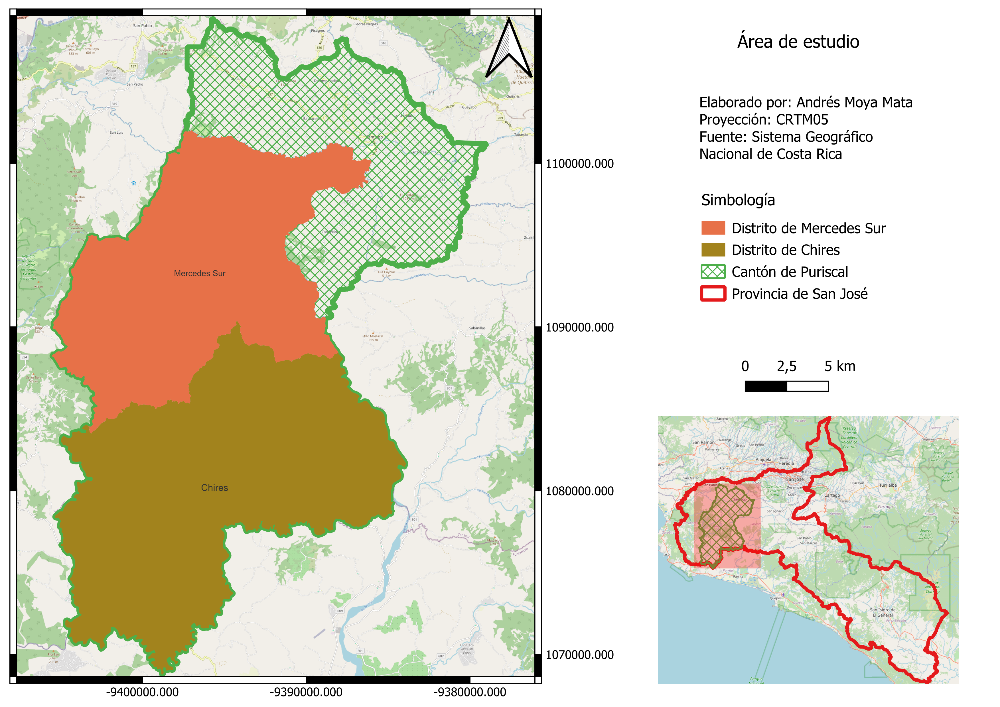
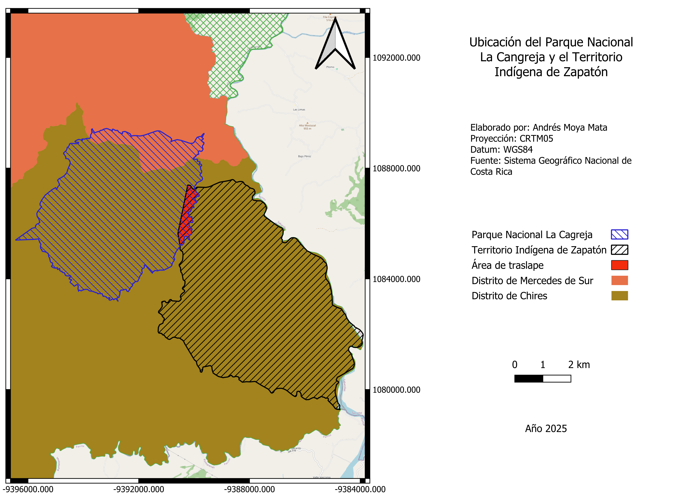

# Vinculacion del patrimonio cultural del Territorio Huertar de Zapaton en el Plan de Manejo del Parque Nacional La Cangreja

El territorio indígena Huetar de Zapatón y el Parque Nacional La Cangreja se encuentran en el cantón de **Puriscal** , en la provincia de San José. Específicamente el territorio de Zapatón se encuentra en el distrito de Chires, por otra parte el Parque Nacional La Cangreja se encuentra entre los distritos de Mercedes Sur y el distrito de Chires como lo podemos apreciar en los siguientes mapas:

## Extension del Parque Nacional La Cangreja

La Cangreja tiene una extension de _2.519 a 2.570 hectáreas_

### Pagina del Plan de Manejo actual

[Sitio web del SINAC](https://sinac.go.cr/ES/ac/accvc/pnlc/Paginas/default.aspx)

### Pueblo Huetar

*En esta seccion daremos un poco de contexto acerca de la poblacion indigena Huetar*

[Wikipedia](https://es.wikipedia.org/wiki/Huetares)

#### *Muchos de los sitios sagrados de la población Huetar de Zapatón surgen de los ríos, nacientes quebradas y principalmente cascadas*

