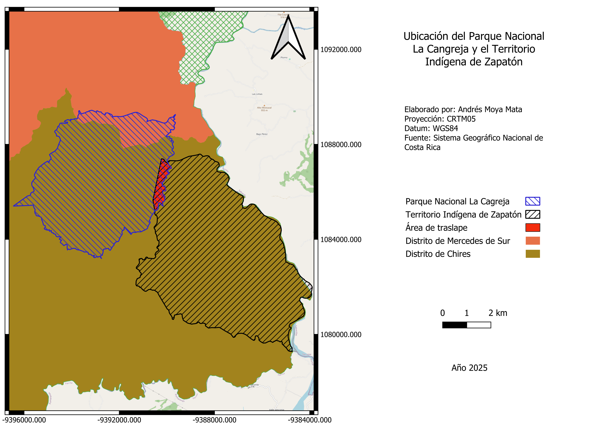
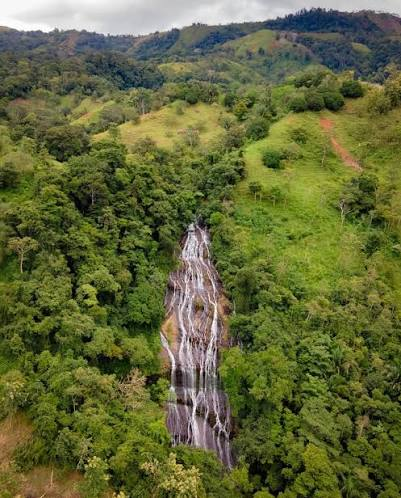

# Vinculacion del patrimonio cultural del Territorio Huetar de Zapatón en el Plan de Manejo del Parque Nacional La Cangreja

El territorio indígena Huetar de Zapatón y el Parque Nacional La Cangreja se encuentran en el cantón de Puriscal, en la provincia de San José, Costa Rica. Específicamente, el Territorio de Zapatón se encuentra en el distrito de Chires y, por otra parte, el Parque Nacional La Cangreja se encuentra entre los distritos de Mercedes Sur y Chires, como lo podemos apreciar en los siguientes mapas:

### Elaboración propia

## Contexto sobre el Parque Nacional La Cangreja

El Parque Nacional La Cangreja se creó en 2002 con el propósito de preservar el estado natural del Cerro La Cangreja, los ecosistemas boscosos que lo cubren, así como el recurso hídrico que nace desde el territorio de este cerro (SINAC, 2018).

En este se pueden identificar más de 1.000 especies de plantas, de las cuales 350 especies son árboles y arbustos entre los que destacan la *Plinia puriscalensis* y la *Ayenia mastatalensis*, dos especies nuevas para la ciencia que hasta el momento son endémicas de Costa Rica y conocidas solamente en La Cangreja.

La Cangreja protege especies de fauna de gran importancia tales como:

1. Tigrillo (*Felis wiedii*)
2. Mono cara blanca (*Cebus capucinus*)
3. Perezoso (*Choloepus hoffmani*)
4. Armadillo (*Dasypus novemcinctus*)
5. Coyote (*Canis latrans*)
6. Mapache (*Procyon lotor*)
7. Pava (*Penelope purpurascens*)
8. Pájaro campana (*Procnias tricarunculata*)
9. Cusingo (*Pteroglossus torquatus*)
10. Tepezcuintle (*Agouti paca*)
11. Saíno (*Tayassu tajacu*).

## Contexto sobre el Territorio Indígena Huetar de Zapatón

Costa Rica desde el año 1992 es signataria del Convenio sobre Pueblos Indígenas y Tribales, 1989, de la OIT que respalda los derechos de las personas indígenas (Procuraduría General de la República, 1992).

Con la creación de la Asociación Indígena Integral de Desarrollo Comunal de Zapatón el 28 de noviembre de 1976 se inició el proceso formal para la creación del Territorio Indígena mediante una solicitud al Poder Ejecutivo.

En La Gaceta del 10 de agosto de 1981 se establece al Territorio de Zapatón como **Caserío Indígena**. Con el *Decreto Ejecutivo N.° 13569-G*, publicado en La Gaceta el día 17 de mayo de 1982, se establece al entonces Caserío Indígena de Zapatón la jurisprudencia de *Reserva Indígena*.

Según el Atlas de los Pueblos Indígenas de Costa Rica (2014), la cultura güetar cuenta con 1354 personas.

## Página del Plan de Manejo actual del Parque Nacional La Cangreja

[Página del SINAC](https://sinac.go.cr/ES/ac/accvc/pnlc/Paginas/default.aspx)

## Problema con el traslape entre el Territorio y el Parque

La Cangreja limita con la Reserva Indígena de Zapatón, aspecto que ayudaría a preservar la cultura proteccionista sobre los recursos naturales tradicionalmente realizada por los aborígenes.

La comunidad güetar forma parte de los actores presentes en la Zona de Amortiguamiento. En la actualización del Plan General de Manejo del Parque Nacional La Cangreja se ha diagnosticado un traslape entre la delimitación del ASP y del territorio indígena. Este traslape es de 68,05 hectáreas, como lo pudimos apreciar a detalle y de color rojo en el segundo mapa mostrado al inicio de este trabajo.

## Contexto sobre el Pueblo Huetar

*En esta sección más adelante daremos un poco de contexto acerca de la población indígena Huetar.*

[Wikipedia](https://es.wikipedia.org/wiki/Huetares)

#### En base al trabajo práctico académico que realicé en el SINAC

Nos enteramos por medio de diversos actores locales que **muchos de los sitios sagrados de la población Huetar de Zapatón surgen de los ríos, nacientes, quebradas y principalmente cascadas**, como la que mostramos a continuación, la cual lleva por nombre Catarata El Rey. Esto porque, según se cuenta, cerca de esta catarata tuvo su casa el famoso cacique Garabito.

### Elaboración propia

## Bibliografía
- Organización Internacional del Trabajo. (1989). Convenio sobre pueblos indígenas y tribales, 1989 (núm. 169). Oficina del Alto Comisionado de las Naciones Unidas para los Derechos Humanos.
  [OIT](https://www.ohchr.org/es/instruments-mechanisms/instruments/indigenous-and-tribal-peoples-convention-1989-no-169)
- Programa Estado de la Nación. (2016). Atlas de los pueblos indígenas de Costa Rica. CONARE.
- Procuraduría General de la República. (1992). Convenio N.° 169 sobre pueblos indígenas y tribales en países independientes, Ley N.° 7316.
- SINAC (Sistema Nacional de Áreas de Conservación). (2018). Actualización del Plan General de Manejo del Parque Nacional La Cangreja. Área de Conservación Cordillera Central.

  
